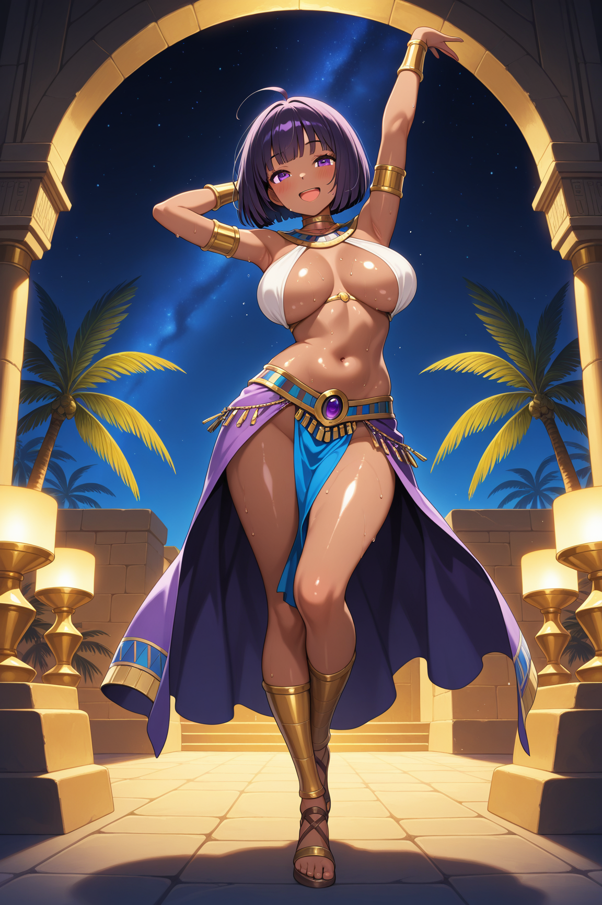
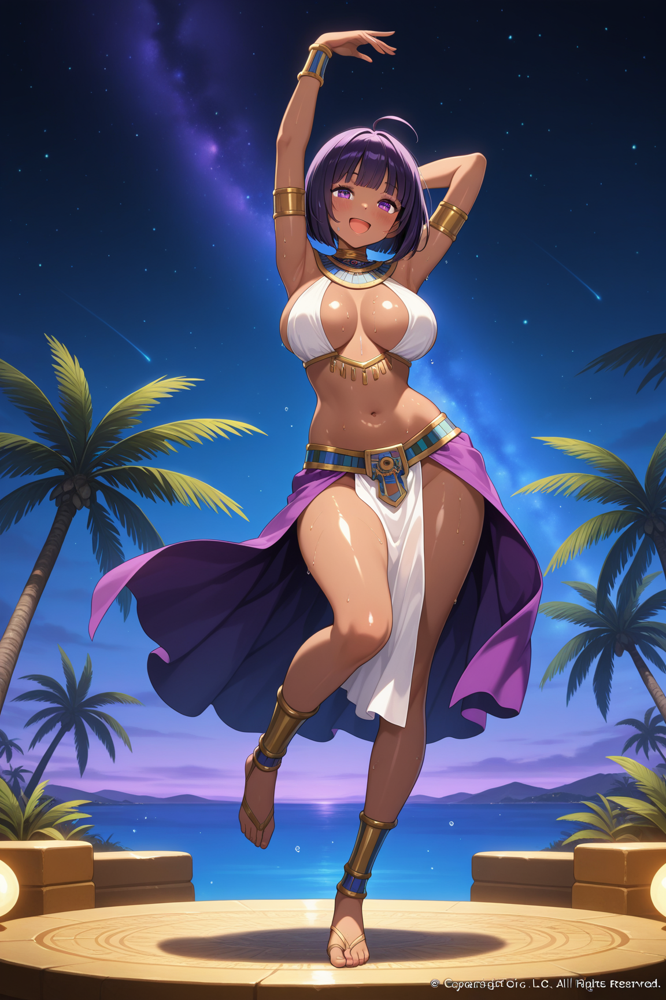
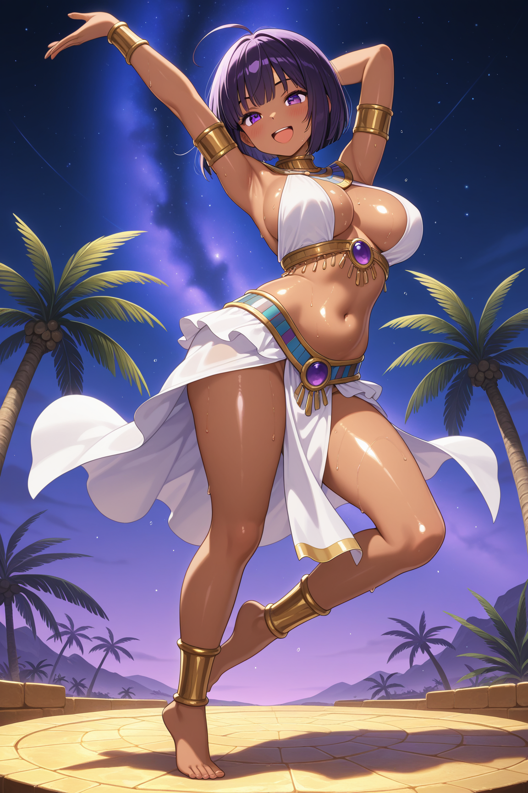
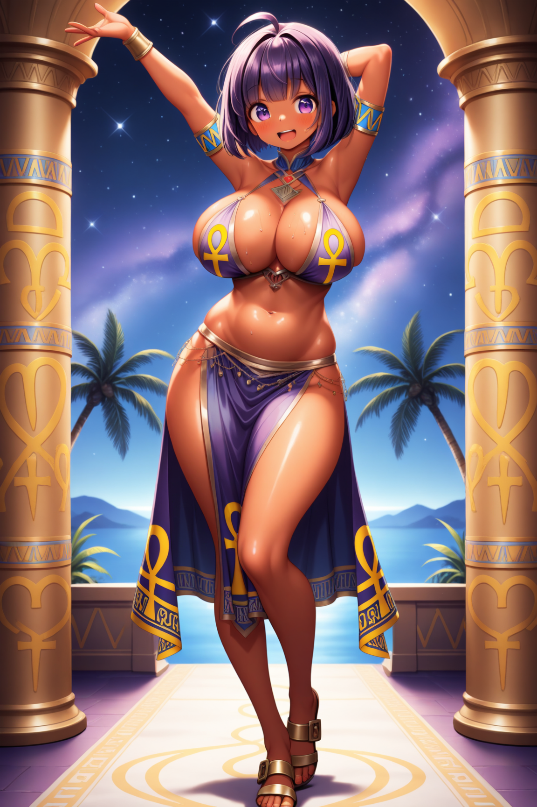
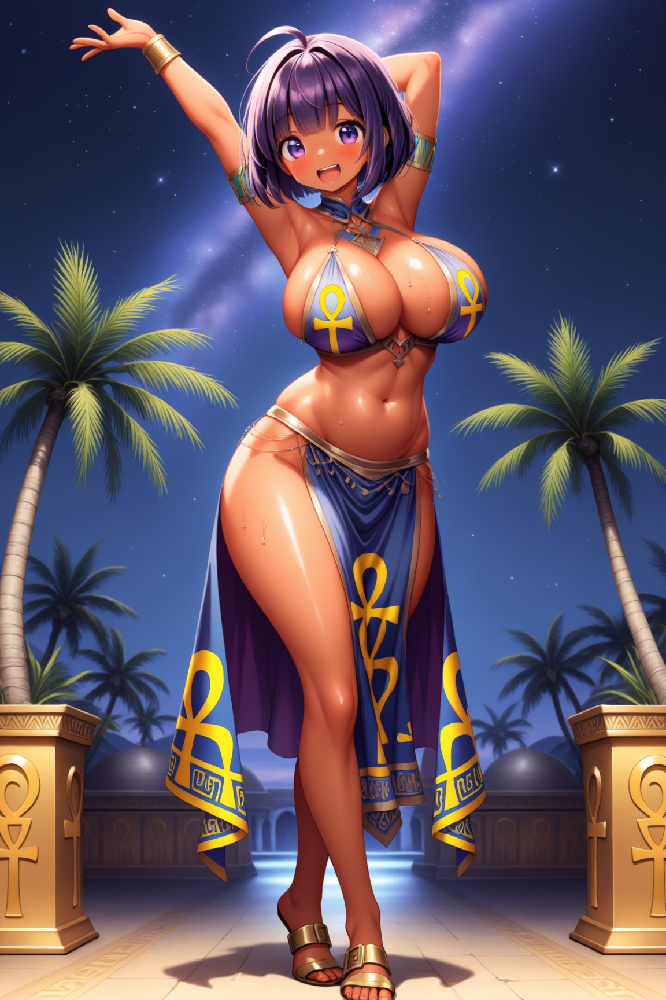
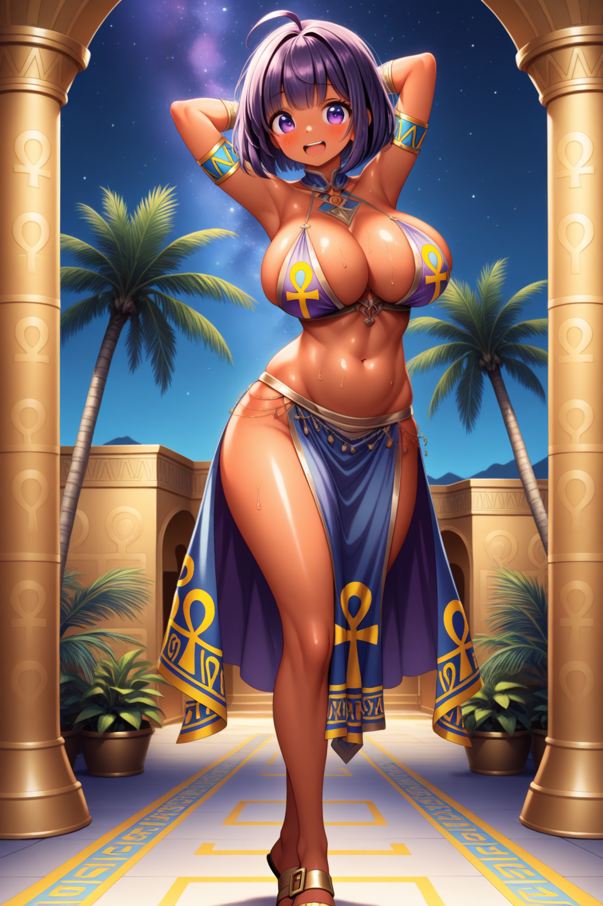

# lora-character-consistency
Improving character consistency using LoRA in Stable Diffusion

# LoRAによるキャラクター再現性改善

## 概要
Stable Diffusionにおいて同一キャラクターの再現性が低い問題を、
LoRA開発により改善したプロジェクト。

## 課題
- 同一キャラクターの顔・髪型・体型が安定しない
- 継続的なコンテンツ制作が困難

## 解決
- LoRAを用いたキャラクター特化モデルを開発
- 学習データ設計（ポーズ・角度・構図の分散）
- 過学習を防ぐためのデータ量調整

## 技術
- Stable Diffusion（Illustrious系）
- kohya_ss
- RunPod（クラウドGPU）
- ComfyUI / A1111

## 結果
- キャラクターの再現性が向上
- 継続的な画像生成が可能になった

## 比較

※同一プロンプト・同一条件で生成  
※LoRA適用時は追加部分のみ変更

---

### LoRAなし

**Prompt**

```text
masterpiece,best quality,amazing quality,1girl,solo,dancing girl,full body,from front,large breasts,happy smile,dark-skinned female,bob cut,purple short hair,purple eyes,loincloth,skirt,blush,ahoge,shiny skin,sweat,dancing,belly dance,dancing pose,arm behind head,arms up,fantasy illustration,ancient world,open mouth,night,night sky,starry_sky,palm tree,outdoors,ancient egyptian background,
```





---

### LoRAあり

```text
masterpiece,best quality,amazing quality,
👉 <lora:neferti_lora_v1:1>, Neferti 👈
1girl,solo,dancing girl,full body,from front,large breasts,happy smile,dark-skinned female,bob cut,purple short hair,purple eyes,loincloth,skirt,blush,ahoge,shiny skin,sweat,dancing,belly dance,dancing pose,arm behind head,arms up,fantasy illustration,ancient world,open mouth,night,night sky,starry_sky,palm tree,outdoors,ancient egyptian background,
```





## 改善要因

- LoRAによりキャラクター固有の特徴（顔・髪型・体型）を学習
- 学習データをポーズ・角度・構図で分散させた
- 過学習を防ぐためデータ量を調整
- ベースモデル単体では保持できない特徴を補完

## 再現手順

1. Stable Diffusion（Illustrious系）を使用
2. 同一プロンプトで生成
3. LoRA未使用状態で出力
4. LoRA適用状態で出力
5. 出力結果を比較

## 工夫した点

- Gemini / Qwenを用いた学習データ生成
- データの品質と多様性を両立
- ローカル環境 + RunPodでの運用切り替え

## モデル選定理由

### Stable Diffusion（Illustrious系）を選択した理由

- アニメイラストに特化しており、目的の表現に適している
- 絵柄違いの派生モデルが豊富に存在し、同一キャラクターのままスタイル変更が可能
- ローカル環境で動作可能であり、運用コストが低い
- LoRAを適用することでキャラクター再現性を安定させやすい

---

### 他モデル（Qwen / Gemini）との比較

Qwen Image Edit や Gemini（nanobanana）でもキャラクター再現性は一定程度担保可能だが、以下の理由により採用しなかった。

- 運用コストが高い（クラウド依存）
- nanobananaはローカル環境での実行が困難
- アニメイラストに特化していないため、絵柄の一貫性が弱い
- 出力の安定性がプロンプト制御に依存しやすい

---

### 採用方針

本プロジェクトでは、

- 「キャラクター再現性」
- 「絵柄の一貫性」
- 「運用コスト」

のバランスを重視し、Stable Diffusion + LoRA の構成を採用した。
